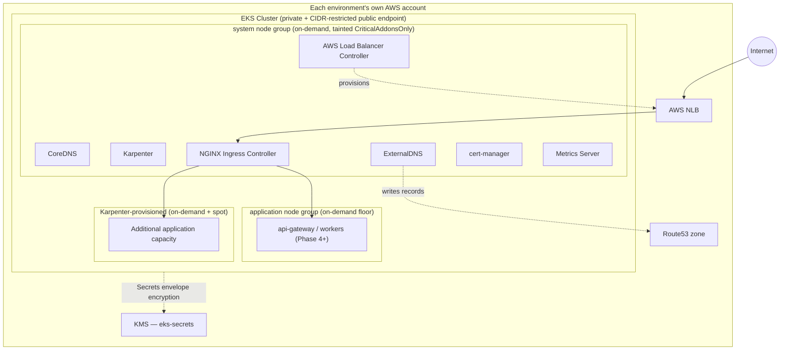

# Cluster architecture

Three EKS clusters — one per environment (`development`, `staging`, `production`), each in its own
AWS account (`cloud-architecture-blueprint.md` Section 2) — no shared/multi-tenant cluster
anywhere in this platform.

## Two-stage Terraform (why)

Each environment splits into `cluster/` (control plane, node groups, OIDC provider — `modules/eks`)
and `platform/` (every Helm/Kubernetes-manifest-based addon — `modules/eks-addons`), as two
**separate Terraform states**, applied in order. This is not a stylistic choice: the `kubernetes`
and `helm` providers must be configured with the cluster's real endpoint and CA certificate, which
don't exist as known values until the cluster itself has already been created — combining both
into one `terraform apply` is a well-known Terraform limitation (provider blocks are configured
before any resource in that same configuration exists), not something this repository's design
overlooked. See the root README and each environment's `platform/versions.tf`.

## Node topology

| Node group | Managed by | Capacity type | Purpose |
| --- | --- | --- | --- |
| `system` | EKS managed node group (`modules/eks`) | On-demand, fixed 3 nodes | Cluster-critical add-ons only (tainted `CriticalAddonsOnly`) — never spot-interruptible |
| `application` | EKS managed node group (`modules/eks`) | On-demand, environment-sized floor | The capacity that must always exist regardless of spot availability |
| Karpenter `general-purpose` | Karpenter NodePool (`modules/eks-addons`) | On-demand | Scales above the managed floor |
| Karpenter `general-purpose-spot` | Karpenter NodePool (`modules/eks-addons`) | Spot, diversified across `m6i`/`m6a`/`m5`/`m5a` | Cost-optimized burst capacity — safe because every application Deployment carries a PodDisruptionBudget (backend repo's `k8s/`) |

## Network policy enforcement

The AWS VPC CNI's native NetworkPolicy support is enabled (`modules/eks-addons/core-addons.tf`) —
no separate policy engine (Calico, Cilium) — enforcing the backend repository's existing
`k8s/base/networkpolicy.yaml` default-deny-plus-explicit-allow rules unchanged.

## Related documentation

`eks-bootstrap-guide.md` (deployment order), `eks-platform-guide.md` (what's installed and why),
`karpenter-guide.md`, `ingress-guide.md`, `dns-guide.md`, `irsa-guide.md`, `eks-upgrade-guide.md`,
`eks-disaster-recovery.md` — all in this directory. Module-level detail lives in
`modules/eks/README.md` and `modules/eks-addons/README.md`.
