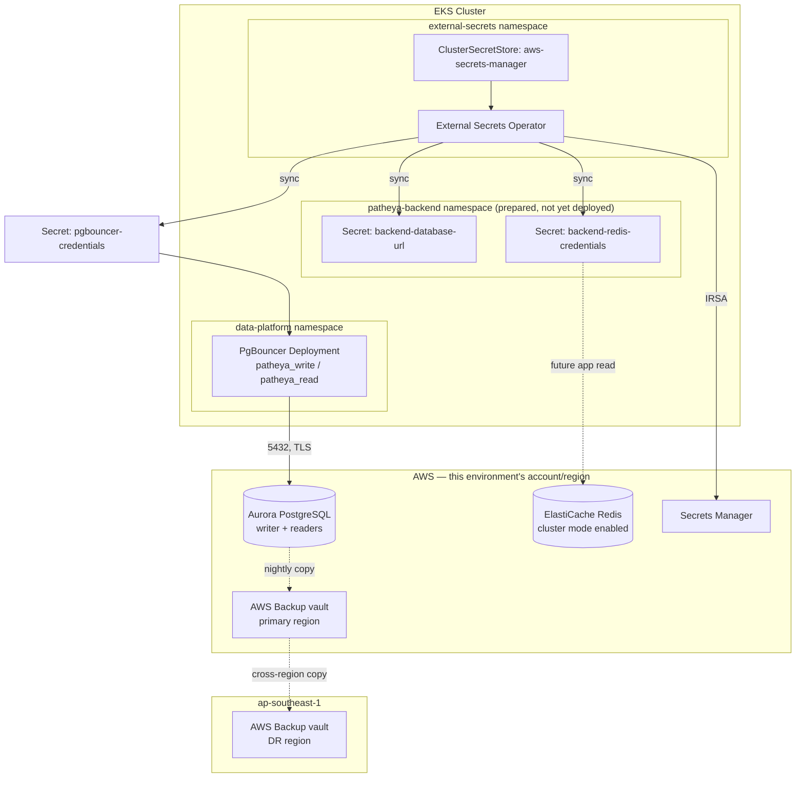
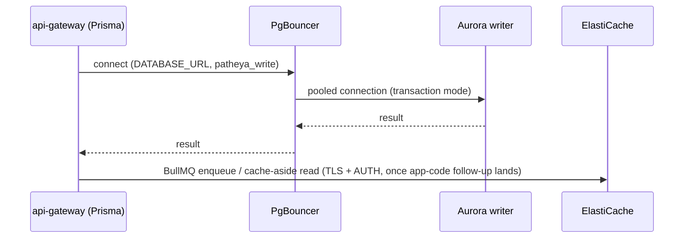
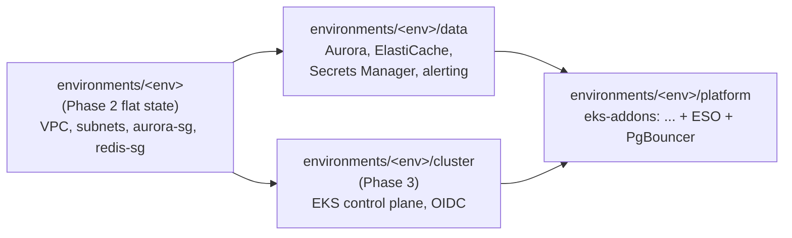

# Data platform architecture

## Component diagram

## Request path (once the application is deployed — Phase 4's blueprint-assigned app-code work)

## Two-stage state, mirroring Phase 3's cluster/platform split

`data/` depends only on the flat network state (same dependency shape as `cluster/`) — it can
apply in parallel with `cluster/`, not after it. `platform/` is the one stage that depends on
**both**: it needs `cluster/`'s OIDC provider (for every IRSA role) and `data/`'s Aurora/Redis/
Secrets Manager outputs (for PgBouncer's config and every `ExternalSecret`'s `remoteRef`).

## Why a third state and not a fourth

An earlier design considered a separate `data-addons/` state (mirroring `cluster/` →
`platform/`) purely for PgBouncer/External Secrets Operator, to keep "AWS resources" and
"Kubernetes resources" cleanly separated per state. Rejected: `platform/` already exists
specifically as "the Kubernetes/Helm stage that needs `cluster/`'s outputs" — PgBouncer and
External Secrets Operator are exactly that, or Karpenter/NGINX/cert-manager wouldn't be either.
Adding a fourth state would replicate `platform/`'s provider configuration for no separation
benefit; extending the existing `platform/` module call is the smaller, more consistent change.
